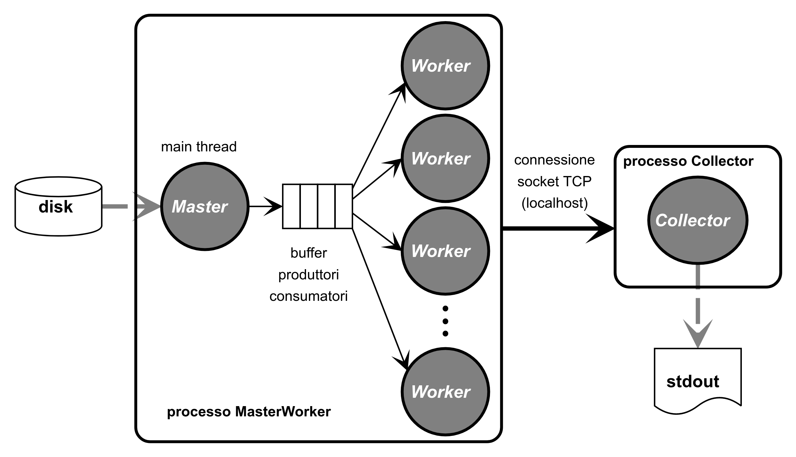

## Progetto Tiny farm


Si chiede di realizzare un progetto che implementa lo schema di comunicazione tra processi e thread mostrato in figura:



Il progetto è composto da due processi, il primo in C denominato *MasterWorker* (eseguibile `farm`); il secondo  in Python denominato *Collector* (eseguibile `collector.py`). 

*MasterWorker* è un processo multi-threaded composto da un thread Master e da `n` thread Worker (il numero di thread Worker può essere variato utilizzando l’argomento opzionale `-n`, vedere nel seguito). Il programma prende come argomenti sulla linea di comando una lista di file binari contenenti interi lunghi (`long`) ed un certo numero di argomenti opzionali (opzioni `-n`, `-q` e `-t` discusse in seguito). 

Il processo *Collector* deve essere lanciato indipendentemente dal processo *MasterWorker* e non prende argomenti sulla linea di comando. I due processi comunicano attraverso una connessione socket `INET/STREAM` (TCP) usando per semplicità l’indirizzo `localhost`. Il processo *Collector* deve svolgere il ruolo di server e deve essere in grado di gestire più client contemporaneamente, eventualmente usando più thread.


Più dettagliatamente:

* Il processo *MasterWorker* legge i nomi dei file passti sulla linea di comando e li passa uno alla volta (con eventuali altri parametri) ai thread Worker mediante il meccanismo produttori/consumatori. Il generico thread Worker si occupa di leggere il contenuto del file ricevuto in input e di calcolare la somma:

dove `N` è il numero dei `long` nel file, e `file[i]` è l'i-esimo `long` del file. Questo valore deve essere inviato, unitamente al nome del file, al processo  *Collector*.

* Il processo *MasterWorker* deve gestire il segnale SIGINT. Alla ricezione di tale segnale il processo deve completare i task eventualmente presenti nel buffer produttori/consumatori e terminare dopo aver deallocato la memoria utilizzata e cancellato ogni eventuale file temporaneo. Se non viene inviato il segnale SIGINT, la procedura qui sopra deve essere seguita quando sono stati processati tutti i file passati sulla linea di comando. In entrambi i casi prima di terminare *MasterWorker* deve inviare al processo *Collector* uno speciale messaggio che faccia terminare il server. 


* Il processo *Collector* come detto svolge il ruolo di un server e stampa i valori ottenuti su `stdout` nel formato
```
somma nomefile
```
Il server non termina spontaneamente ma rimane in attesa di nuove interrogazioni fino a quando non riceve il messaggio speciale di terminazione dal *MasterWorker* (dovete scegliere voi in cosa consiste il messaggio di terminazione).


### Note

Gli argomenti che opzionalmente possono essere passati al processo MasterWorker sono i seguenti:

*  `-n nthread` specifica il numero di thread Worker del processo MasterWorker (valore di default 4)

*  `-q qlen` specifica la lunghezza del buffer produttori/consumatori (valore di default 8)

 * `-t delay`specifica un tempo in millisecondi che intercorre tra l’invio di due richieste successive ai thread Worker da parte del thread Master (serve per il debugging, valore di default 0)

Per leggere le opzioni sulla riga di comando utilizzare la funzione `getopt(3)`; un esempio d’uso si trova in fondo alla pagina man

La dimensione dei file in input non è limitata ad un valore specifico. Si supponga che la lunghezza del nome dei file sia non superiore a 255 caratteri. 


### Materiale fornito

* Un programma `somme.py` che calcola la somma per tutti i file passati sulla linea di comando (`somme.py -h` per l'help)
* Un programma `gensomma.py` che genera un file con un numero assegnato di `long` e possibilmente con una somma assegnata (`gensomma.py -h` per l'help)
* Il file `z0.dat` contenente 3 `long` con somma 9876543210 (notate che questo valore non si rappresenta in 32 bit!)
*  Il file `z1.dat` contenente 3 `long` con somma -1 (così siamo sicuri che tutto funziona anche con interi negativi) 


### Consegna del progetto

La consegna deve avvenire esclusivamente mediante [GitHub](https://www.github.com/login). Se non lo avete già [createvi un account](https://docs.github.com/en/get-started/quickstart/hello-world) e create un repository privato dedicato a questo compito. Aggiungete come collaboratore al repository l’utente `Laboratorio2B` in modo che i docenti abbiano accesso al codice. *IMPORTANTE: la consegna effettiva del progetto per un dato appello consiste nello scrivere l'url del vostro progetto nell'apposito contenitore consegna su moodle.* 

Il repository deve contenere tutti i file del progetto oltre ai file menzionati sopra. Il makefile deve essere scritto in modo che la sequenza di istruzioni sulla linea di comando:
```
git clone git@github.com:user/progetto.git
make
./collector.py &      # parte il server in background
./farm z?.dat         # invia i file z0.dat e z1.dat
```
non restituisca errori, faccia terminare il server, e generi l'output
```
9876543210 z0.dat
        -1 z1.dat
```
Verificate su `laboratorio2.di.unipi.it`, *partendo da una directory vuota*, che non ci siano errori e che l'output corrisponda. Questo è un requisito *minimo* per la sufficienza; altri test saranno fatti durante la correzione ma sempre su `laboratorio2`, e ovviamente sarà valutato anche il codice. Il programma deve gestire in maniera pulita evenutali errori (file non esistenti, server che non risponde etc.). 

Il repository deve contenere anche un file README.md contenente una breve relazione che descrive le principali scelte implementative. Si noti che è possibile gestire un repository GitHub anche da [dentro Replit](https://replit.com/talk/learn/Replit-Git-Tutorial/23331). 
